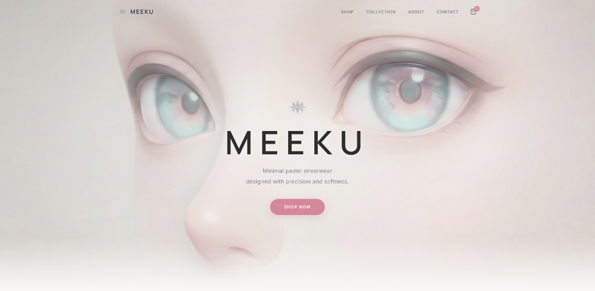

<p align="center">
  
</p>

<h1 align="center">MEEKU</h1>

<p align="center">
  <em>Minimal pastel streetwear — designed with precision and softness.</em>
</p>

<p align="center">
  
  
  
</p>

---

## About

MEEKU is a premium clothing brand website built with a fashion-forward, editorial design language. The entire color palette is derived from the brand logo — soft dusty rose and muted teal — creating a calm, centered, and visually cohesive experience.

> **⚠️ Disclaimer**
> This is an entirely **fictional and hypothetical** project. MEEKU is not a real brand, company, or product. This website was created solely as a front-end development and design exercise for portfolio purposes. No real products are being sold, and no commercial activity is associated with this project. All product names, descriptions, and imagery are fabricated for demonstration only.

## Features

- **Hero Section** — Full-bleed background image with subtle parallax and text overlay
- **Featured Collection** — Curated product grid with Quick View modals
- **Shop Page** — Full catalog with search, category filters, and sorting
- **Product Modal** — Size selector, description, and Add to Bag functionality
- **Shopping Bag** — Cart page with quantity controls, order summary, and free shipping logic
- **Editorial Section** — Magazine-style layout with lookbook imagery
- **Newsletter** — Email subscription section
- **Responsive** — Fully responsive across all screen sizes
- **Scroll Animations** — Intersection Observer–driven fade-in effects

## Tech Stack

| Tool | Purpose |
|------|---------|
| React 18 | UI framework |
| TypeScript | Type safety |
| Vite | Build tool & dev server |
| React Router | Client-side routing |
| Vanilla CSS | Styling (no utility frameworks) |

## Getting Started

```bash
# Clone the repo
git clone https://github.com/your-username/meeku.git
cd meeku

# Install dependencies
npm install

# Start dev server
npm run dev
```

Open [http://localhost:5173](http://localhost:5173) in your browser.


## Color Palette

| Color | Hex | Usage |
|-------|-----|-------|
| Dusty Rose | `#D4899A` | Primary accent, buttons, highlights |
| Muted Teal | `#7EAAB4` | Secondary accent, hover states |
| Off-White | `#F8F6F3` | Background |
| Soft Black | `#2D2D2D` | Body text |

## License

MIT

---

<p align="center">
  <sub>A fictional portfolio project — not a real brand. Built for demonstration purposes only.</sub>
</p>
